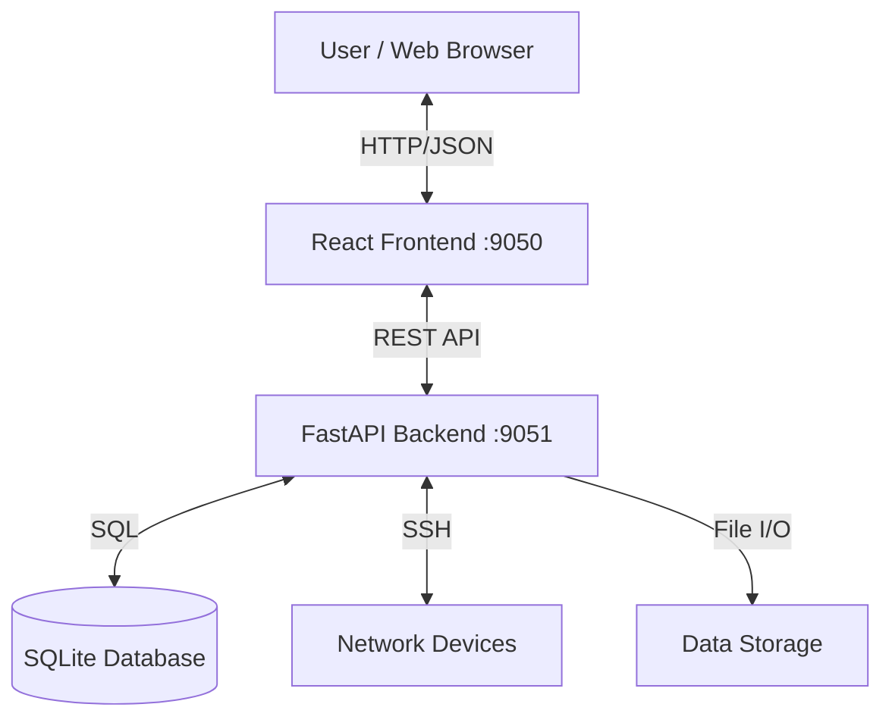

# System Architecture

## Overview
OSPF-LL-DEVICE_MANAGER (NetMan) is a full-stack network automation platform designed to manage Cisco network devices, collect OSPF state data, and visualize network topology.

## High-Level Design



## Components

### Frontend (Port 9050)
- **Framework**: React 19 with TypeScript
- **Build Tool**: Vite
- **Styling**: TailwindCSS
- **State Management**: React Hooks (useState, useEffect, useContext)
- **Routing**: React Router (implied single-page app structure)
- **Visualization**: D3.js (planned for topology)

#### Key Components
- `App.tsx`: Main entry point and routing logic
- `DeviceTable.tsx`: Data grid for device inventory
- `Automation.tsx`: Control panel for SSH jobs
- `DeviceFormModal.tsx`: CRUD form for devices

### Backend (Port 9051)
- **Framework**: FastAPI (Python 3.11)
- **Server**: Uvicorn
- **Database**: SQLite (`devices.db`)
- **Automation Library**: Netmiko (SSH), pyATS (Parsing)

#### Module Structure
- `server.py`: API entry point and route definitions
- `modules/connection_manager.py`: Handles persistent SSH sessions
- `modules/command_executor.py`: Runs commands and saves output
- `modules/file_manager.py`: Manages text/JSON output files
- `modules/topology_builder.py`: Parses data to generate topology JSON

## Data Flow

1. **Device Management**:
   - User adds device -> API POST /devices -> SQLite
   
2. **Automation**:
   - User selects devices -> API POST /automation/connect
   - Backend establishes SSH -> Stores session in memory
   - User executes commands -> API POST /automation/execute
   - Backend runs commands -> Saves raw text -> Parses to JSON -> Saves to disk

3. **Transformation**:
   - User requests topology -> API POST /transform/topology
   - Backend reads collected files -> Parses OSPF/CDP data -> Builds Graph -> Returns JSON

## Directory Structure

```
/
├── backend/
│   ├── modules/          # Business logic
│   ├── data/             # Generated output files
│   ├── devices.db        # Inventory database
│   └── server.py         # API server
├── components/           # React components
├── pages/                # Page views
├── docs/                 # Documentation
└── ...
```

## Security Considerations
- **CORS**: Restricted to localhost:9050 in development
- **Credentials**: Currently stored in plain text (Need to upgrade to bcrypt)
- **Input Validation**: Pydantic models on backend, TypeScript interfaces on frontend
